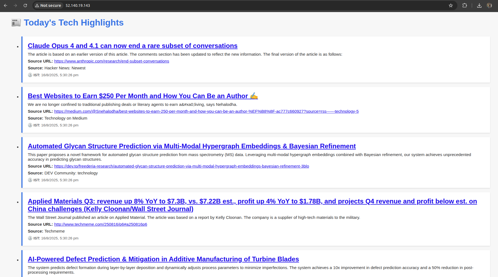

# 📰 Tech News Microservices App

This is a simple full-stack microservices application built using Node.js, Express, Kafka, MongoDB, and Docker Compose. It allows users to post tech news, which is then distributed via Kafka to a notification service, stored in MongoDB, and displayed in a web UI.

---

## 🧱 Architecture


- **news-service**: Accepts news via HTTP POST and publishes to Kafka.
- **notification-service**: Consumes Kafka messages, saves to MongoDB, exposes stored news.
- **web-frontend**: Fetches and displays saved news.
- **Kafka + Zookeeper**: Message broker infrastructure.
- **MongoDB**: Persistent storage.

---

## 📦 Tech Stack

- Node.js + Express.js
- KafkaJS (Kafka client)
- MongoDB
- Docker & Docker Compose
- EJS templating for frontend

---

## 🚀 Getting Started

### 1. Clone the Repository

```bash
git clone https://github.com/<your-username>/tech-news-app.git
cd tech-news-app
```

### 2. Start Infrastructure

This includes Kafka, Zookeeper, and MongoDB:

```bash
docker-compose -f docker-compose.infra.yml up -d --build
```

### 3. Start Microservices

This includes the news-service, notification-service, and web-frontend:

```bash
docker-compose -f docker-compose.services.yml up -d --build
```

### 4. Access the Application

- Web Frontend: http://localhost:3000
- News Service Health: http://localhost:5000/health
- Notification Service Health: http://localhost:4000/health

---

## 📬 API Usage

### POST a News Item (to news-service)

```bash
curl -X POST http://localhost:5000/news \
  -H "Content-Type: application/json" \
  -d '{
    "title": "AI Breakthrough in 2025",
    "summary": "A new AI model surpasses human-level reasoning.",
    "timestamp": "2025-07-30T12:34:00Z"
}'
```

### Fetch Stored News (from notification-service)

```bash
curl http://localhost:4000/news
```

---

## 🧪 Health Check

Each service exposes a `/health` endpoint to verify liveness:

```bash
curl http://localhost:5000/health    # news-service
curl http://localhost:4000/health    # notification-service
curl http://localhost:3000           # frontend (should return HTML)
```

---

## 🛠️ Debugging & Inspection

- List Docker containers:
  ```bash
  docker ps
  ```

- View logs:
  ```bash
  docker logs -f services-news-service-1
  docker logs -f services-notification-service-1
  docker logs -f services-web-frontend-1
  ```

- List networks:
  ```bash
  docker network ls
  docker network inspect news-app-network
  ```

- Verify connectivity inside containers:
  ```bash
  docker exec -it services-notification-service-1 sh
  curl http://localhost:4000/health
  ```

---

## 🗂 Folder Structure


---

## 📦 Example .gitignore

```
node_modules/
.env
dist/
*.log
```

---

## 🗃️ Docker Compose Split

You should have two compose files to separate concerns:

#### Infrastructure (`docker-compose.infra.yml`)
Contains:
- Zookeeper
- Kafka
- MongoDB
- Defines and creates `news-app-network` (external if reused)

#### Application Services (`docker-compose.services.yml`)
Contains:
- news-service
- notification-service
- web-frontend
- Reuses the `news-app-network` (external: true)

Start order:
1. Infrastructure: `docker-compose -f docker-compose.infra.yml up -d --build`
2. Services: `docker-compose -f docker-compose.services.yml up -d --build`

---

## 🧠 Notes on Service Responsibilities

- **news-service** is the producer: receives POST `/news` and publishes to Kafka.
- **notification-service** is the consumer: subscribes to `tech-news` topic, saves to MongoDB, and serves saved news on `/news`.
- **web-frontend** fetches from `notification-service` and renders the UI.

---

## 🗃 Persisted Data

- MongoDB database: `tech-news`
- Collection: `news`
- You can inspect via:
  ```bash
  docker exec -it infra-mongodb-1 mongo tech-news
  show collections
  db.news.find().pretty()
  ```

---

## 🧰 Local Development Tips

- If Kafka is not yet ready when services start, add retries/backoff in the Kafka client connection.
- Use service hostnames (`kafka`, `mongodb`) inside Docker; use `localhost` when testing outside containers.
- Ensure ports in code (`PORT`) match the Docker Compose port mappings.

---

## 📦 Git & GitHub Setup

```bash
git init
echo "node_modules
.env
dist
*.log" > .gitignore
git add .
git commit -m "Initial commit of tech news microservices app"
git branch -M main
git remote add origin https://github.com/<your-username>/tech-news-app.git
git push -u origin main
```

---
## How To use with K8S

# Starting
minikube start --driver=docker --network=bridge
minikube tunnel &
kubectl apply -f https://raw.githubusercontent.com/kubernetes/ingress-nginx/main/deploy/static/provider/cloud/deploy.yaml
kubectl get svc -n ingress-nginx
Add Ingress external IP to hosts file
kubectl create namespace infra
kubectl create namespace news-app

# From K8s infra Dir
kubectl apply -f zookeeper-deployment.yaml 
kubectl apply -f kafka-deployment.yaml 
minikube ip #check and use this as nodeport IP
kubectl apply -f kafka-nodeport.yaml 
kubectl apply -f mongodb-deployment.yaml

# From K8s App dir
kubectl apply -f ingress.yml
kubectl apply -f news-service-deployment.yaml #Make sure your Kafka broker is <nodeport_IP>:30092
kubectl apply -f notification-service-deployment.yaml #Make sure your Kafka broker is <nodeport_IP>:30092
kubectl apply -f web-frontend-deployment.yaml


# Using AKS for deployment

Create AKS cluster and then

az aks get-credentials --resource-group NewsRG --name NewsAKSCluster

kubectl create namespace infra
kubectl create namespace news-app
kubectl apply -f zookeeper-deployment.yaml
kubectl apply -f kafka-deployment.yaml
kubectl apply -f mongodb-deployment.yaml
kubectl get pods -n infra
kubectl apply -f news-service-deployment.yaml
kubectl apply -f notification-service-deployment.yaml
kubectl apply -f web-frontend-deployment.yam
kubectl apply -f nginx.yml


# To test
curl -X POST http://20.44.60.109/news \
  -H "Content-Type: application/json" \
  -d '{
    "title": "Successfully onboarded to AKS",
    "summary": "Finally onboarded my news app to AKS",
    "timestamp": "2025-07-30T12:34:00Z"
}'

# To resolve minikube tunnel stuck problem
Delete this file after killing the process
~/.minikube/profiles/minikube/.tunnel_lock

## 🧾 Attribution

Author: Vijayendra Hunasgi

---

## 📝 License

MIT License
